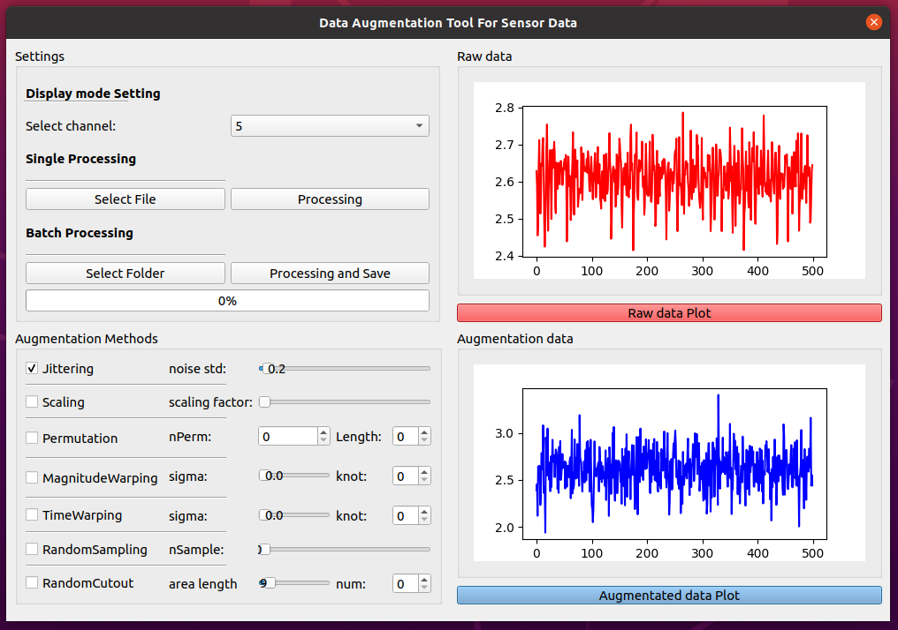

# data-augmentation-for-time-series-data
A tool that can help you to augment your time series data using in machine learning sensors
# Requirements
# GUI

# Usage
## Select the channel you want to import (up to 6 channels).
## Select data files. 
**single flie:** press "Select File" to select the data 
**multi flies:** press "Select Folder" to select a group of data
## Press the right side red botton "Raw data Plot" to preview your data
## Select the Augmentation Methods that you want: 
**Jittering:** a way of simulating additive sensor noise 
**Scaling:** changes the magnitude of the data in a window by multiplying by a random scalar 
**Permutation:** a randomly perturb the temporal location of within-window events. To perturb the location of the data in a single window, we first slice the data into N samelength segments,and randomly permute the segments to create a new window 
**MagnitudeWarping:** changes the magnitude of each sample by convolving the data window with a smooth curve varying around one.  
**TimeWarping:** another way to perturb the temporal location. By smoothly distorting the time intervals between samples, the temporal locations
of the samples can be changed using time-warping. 
**RandomSampling:** random resampling  the signal. 
**RandomCutout:** random cut off some parts of the signal.  
## If you want get more info about the parameters we used, please read this article.  
