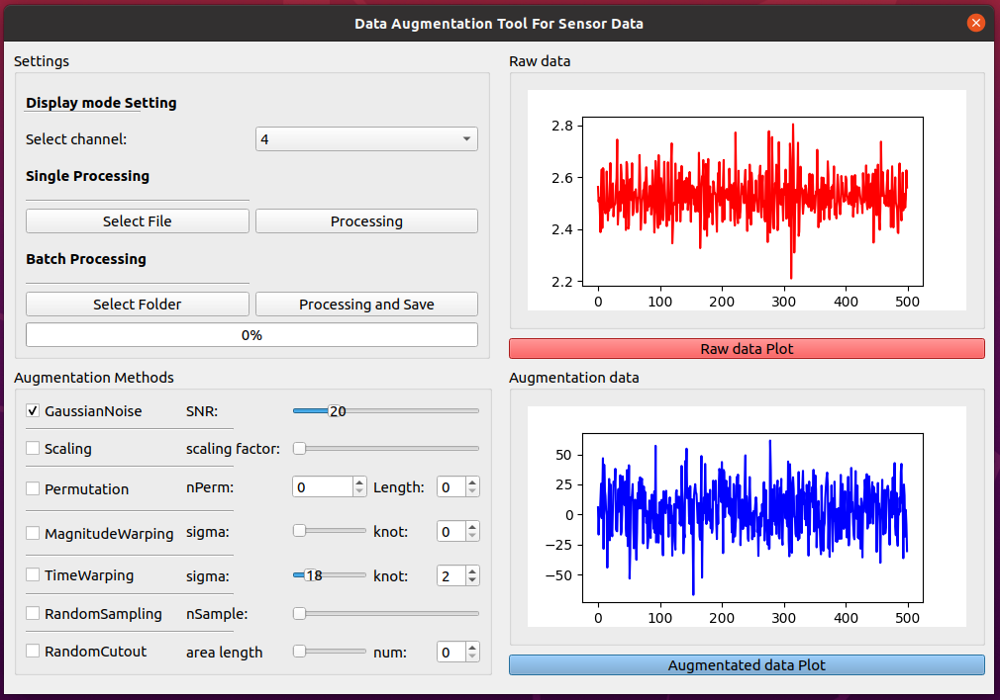
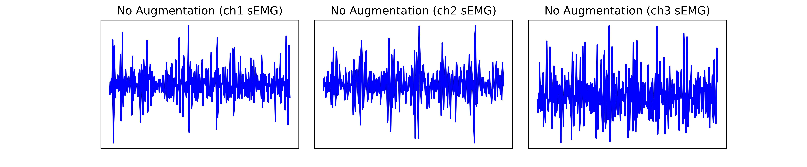

# Data augmentation for time series data
A tool that can help you  augment your time series data customly.

## Table of Contents
 * [Installation](#installation)
 * [Uasge](#usage)
 * [Result](#result)

## Installation
We strongly recommend the usage of Anaconda for managing your python environments. Clone repo and install [requirements.txt](https://github.com/peijichen0324/data-augmentation-for-time-series-data/blob/main/requirements.txt) in a
[**Python>=3.8.0**](https://www.python.org/) environment, including
[**PyQt5==5.15.6**](https://riverbankcomputing.com/software/pyqt/).
This set-up was tested under Windows 10 and Ubuntu 20.04.

```bash
  $ conda create --name augment_tool python=3.8
  $ conda activate augment_tool
  $ git clone https://github.com/peijichen0324/data-augmentation-for-time-series-data  # clone
  $ cd data-augmentation-for-time-series-data/
  $ pip install -r requirements.txt  # install
```

## Usage
<div align='center'>

</div>

### Settings Panel

- `Select channel`: &emsp;&emsp;&ensp;&ensp;       Selects the channel you want to import (up to 6 channels).
- `Select File`:  &emsp;&emsp;&emsp; &ensp;&ensp;  Selects the data file.
- `Select Folder`:  &emsp;&emsp;&emsp;&ensp;       Selects a data folder.
- `Processing and Save`: &ensp;                    Processes data augmentation and save in same folder.
- `Progress Bar`: &emsp;&emsp;&emsp;&ensp;&ensp;   Displays the percentage of data augmentation processes that have completed. 

### Plot Panel

- `Raw data Plot`: &emsp;&emsp;&emsp;&ensp;        Displays the raw data that imported.
- `Augmentated data Plot`:                         Previews the Augmentated data.

### Augmentation Methods Panel

- `Jittering`:&emsp;&emsp;&emsp;&emsp;&emsp; &ensp;   a way of simulating additive sensor noise
- `Scaling`:&emsp;&emsp;&emsp;&emsp;&emsp;&emsp;&emsp;changes the magnitude of the data in a window by multiplying by a random scalar
- `Permulation`:&emsp;&emsp;&emsp;&emsp; &ensp;       a randomly perturb the temporal location of within-window events. 
- `MagnitudeWarping`:&ensp;&emsp;  &ensp;             changes the magnitude of each sample by convolving the data window with a smooth curve varying around one.
- `TimeWarping`:&emsp;&emsp;&emsp;&emsp;   &ensp;     another way to perturb the temporal location. 
- `RandomSampling`:&emsp;&ensp;&emsp;   &ensp;        random resampling  the signal.
- `RandomCutout`:&emsp;&emsp;&ensp;&emsp;   &ensp;    random cut off some parts of the signal.

## Result
<div align='center'>

</div>

<div align='center'>

</div>
