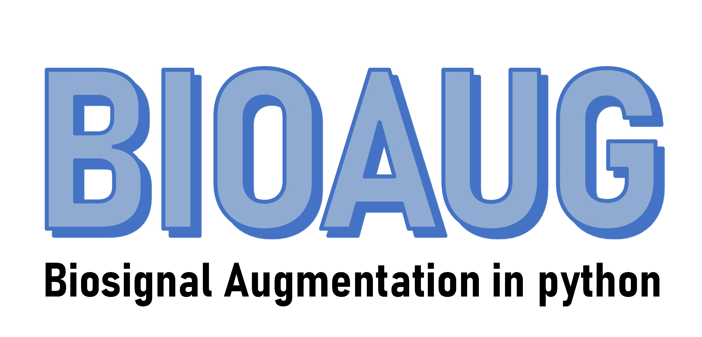
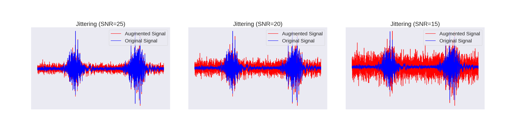
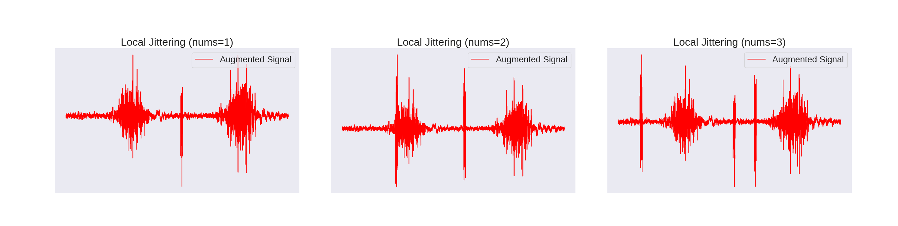
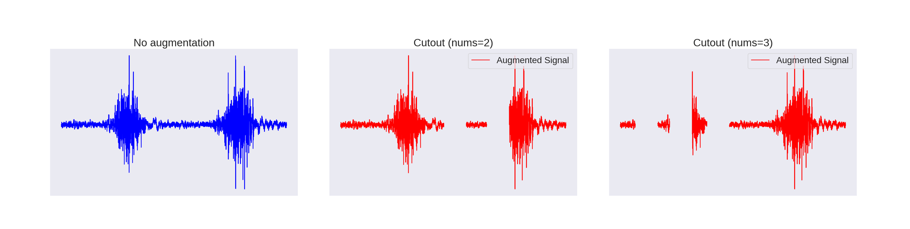
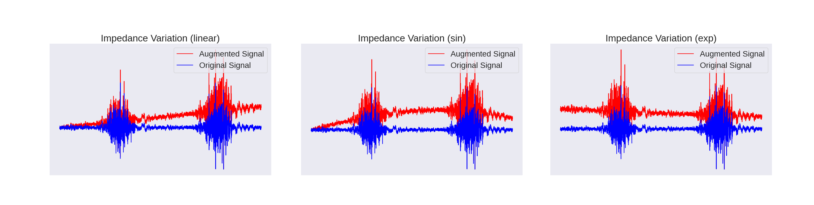
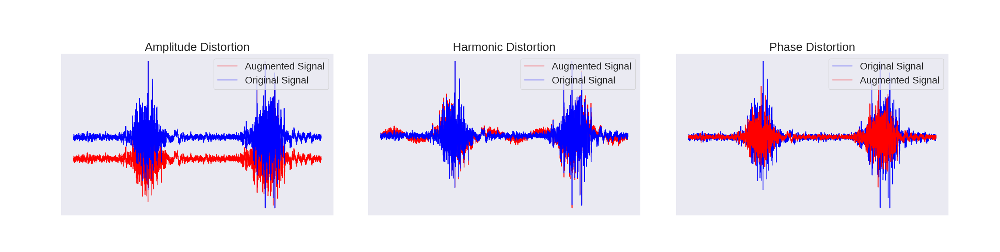
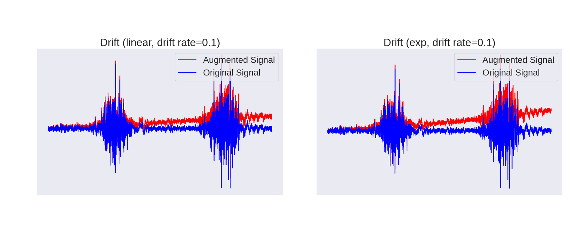
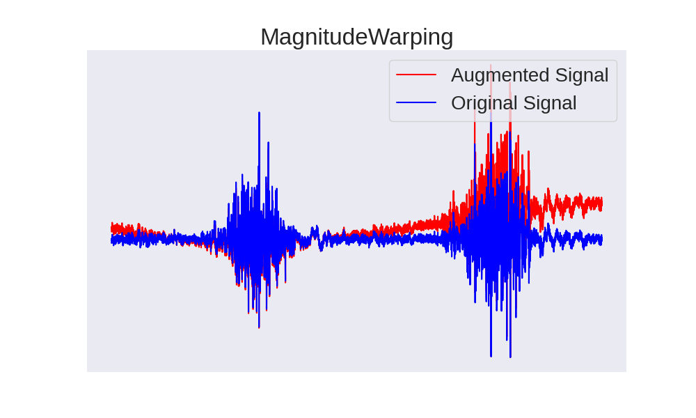
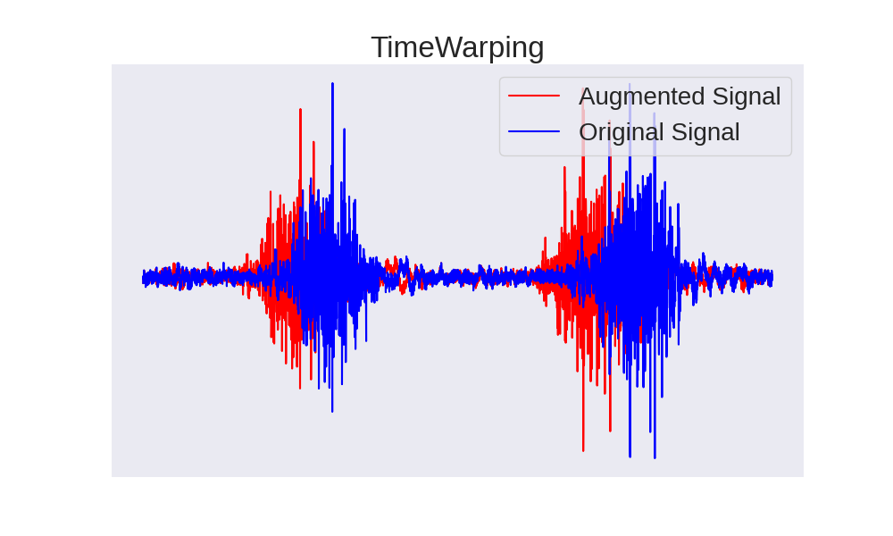
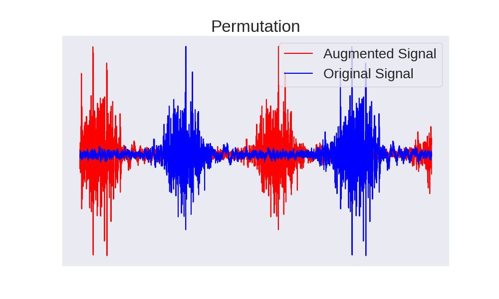

# BioAug - Biosignal Augmentation in Python
*A toolbox for biosignal augmentation written in Python.*

<p align="left">
  
</p>
Deep learning models achieve remarkable performance with the aid of massive data. 
This tool allows you to customly augment your biosignals.

## Table of Contents
 * [Installation](#installation)
 * [Introduction](#introduction)
 * [Uasge](#usage)
 * [Result](#result)

## Installation
We strongly recommend the usage of Anaconda for managing your python environments. Clone repo and install [requirements.txt](https://github.com/peijichen0324/data-augmentation-for-time-series-data/blob/main/requirements.txt) in a
[**Python>=3.8.0**](https://www.python.org/) environment, including
This set-up was tested under Windows 10 and Ubuntu 20.04.

```bash
  $ pip install bioaug
```

## Introduction
* `bio/GaussianNoise.py`
  * [class GaussianNoise](https://github.com/peijii/BioAug/blob/42b8e9c9add135c07af293f4d36ab5bc637ac56e/bioaug/GaussianNoise.py#L4): Add specified Gaussian noise to biosignals.

<p align="center">
  
</p>

* `bio/LocalJittering.py`
  * [class LocalJittering](https://github.com/peijii/BioAug/blob/42b8e9c9add135c07af293f4d36ab5bc637ac56e/bioaug/LocalJittering.py#L5): Add noise of specific length and frequency at random locations in the biosignals.

<p align="center">
  
</p>

* `bio/RandomCutout.py`
  * [class RandomCutout](https://github.com/peijii/BioAug/blob/42b8e9c9add135c07af293f4d36ab5bc637ac56e/bioaug/RandomCutout.py#L4): crop a specific length of a biosignals at a random location to simulate signal loss.

<p align="center">
  
</p>

* `bio/ImpedanceVariation.py`
  * [class ImpedanceVariation](https://github.com/peijii/BioAug/blob/42b8e9c9add135c07af293f4d36ab5bc637ac56e/bioaug/ImpedanceVariation.py#L5): simulate changes in biosignals during variation in skin impedance.

<p align="center">
  
</p>

* `bio/Distortion.py`
  * [class Distortion](https://github.com/peijii/BioAug/blob/42b8e9c9add135c07af293f4d36ab5bc637ac56e/bioaug/Distortion.py#L5): simulate biosignals with distortion during real-world use.

<p align="center">
  
</p>

* `bio/Drift.py`
  * [class SignalDrift](https://github.com/peijii/BioAug/blob/42b8e9c9add135c07af293f4d36ab5bc637ac56e/bioaug/Drift.py#L5): simulate biosignals with drift during real-world use.

<p align="center">
  
</p>

* `bio/MagnitudeWarping.py`
  * [class MagnitudeWarping](https://github.com/peijii/BioAug/blob/42b8e9c9add135c07af293f4d36ab5bc637ac56e/bioaug/MagnitudeWarping.py#L5): apply magnitude warping to biosignals.

<p align="center">
  
</p>

* `bio/TimeWarping.py`
  * [class TimeWarping](https://github.com/peijii/BioAug/blob/42b8e9c9add135c07af293f4d36ab5bc637ac56e/bioaug/TimeWarping.py#L5): apply time warping to biosignals.

<p align="center">
  
</p>

* `bio/Permutation.py`
  * [class Permutation](https://github.com/peijii/BioAug/blob/42b8e9c9add135c07af293f4d36ab5bc637ac56e/bioaug/Permutation.py#L3): apply permutation to biosignals.

<p align="center">
  
</p>

* `bio/Scaling.py`
  * [class Scaling](https://github.com/peijii/BioAug/blob/42b8e9c9add135c07af293f4d36ab5bc637ac56e/bioaug/Scaling.py#L4): apply scaling to biosignals.

<p align="center">
  
</p>


## Usage
This library provides a series of data augmentation methods. The following is an example of using the `LocalJittering` method. The `LocalJittering` method is used to randomly add local high-frequency jitter to the input time series signal.

### Parameters

- `p (float)` : Probability of applying jitter, range [0, 1].
- `alpha (float, tuple, list)` : Scale factor for the high-frequency noise. Can be a fixed value, a range, or a list.
- `frequency (int, tuple, list)` : Frequency of jitter noise. Can be a fixed value, a range, or a list.
- `duration (int, tuple, list)` : Duration (in time steps) of each jitter event. Can be a fixed value, a range, or a list.
- `num_jitters (int, tuple, list)` : Number of jitter events to add. Can be a fixed value, a range, or a list.

### Example Usage
1. **Fixed values, tuples, and lists combination**:

```python
from bioaug import LocalJittering

# Example of mixing fixed values, ranges (tuples), and lists
jitter = LocalJittering(
    p=0.8,                  # Probability of applying jitter
    alpha=0.5,              # Fixed alpha value
    frequency=(40, 60),     # Random frequency in the range [40, 60]
    duration=[10, 20, 30],  # Random duration chosen from the list [10, 20, 30]
    num_jitters=2           # Fixed number of jitter events
)

# Assume 'signal' is the input time-series data
augmented_signal = jitter(signal)